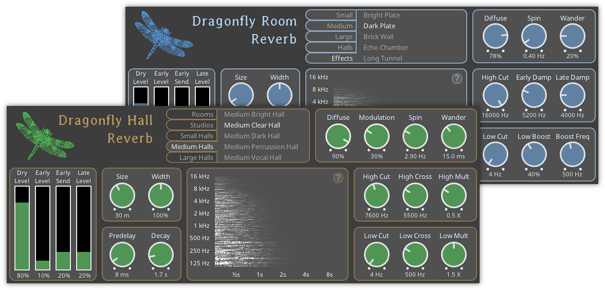

# [Dragonfly Reverb](https://michaelwillis.github.io/dragonfly-reverb/)
Dragonfly Reverb is a bundle of free audio effects for Linux, MacOS, and Windows. 



## Download

* **[Linux](https://github.com/michaelwillis/dragonfly-reverb/releases/download/3.2.0/DragonflyReverb-Linux-64bit-v3.2.0.tgz)**
* **[MacOS](https://github.com/michaelwillis/dragonfly-reverb/releases/download/3.2.0/DragonflyReverb-MacOS-64bit-v3.2.0.zip)**
* **[Windows (32 bit)](https://github.com/michaelwillis/dragonfly-reverb/releases/download/3.2.0/DragonflyReverb-Windows-32bit-v3.2.0.zip)**
* **[Windows (64 bit)](https://github.com/michaelwillis/dragonfly-reverb/releases/download/3.2.0/DragonflyReverb-Windows-64bit-v3.2.0.zip)**

## Dependencies

Dragonfly reverb requires GL >= 3.0 to show the graphical interface.

## Building

On Linux or MacOS, invoke `make` to build Dragonfly Reverb.

### Linux Build Dependencies

* libx11-dev
* libgl1-mesa-dev
* libjack-jackd2-dev

You can build against the system freeverb3 with using SYSTEM_FREEVERB3=true at build time. If this flag is not set, the bundled freeverb3 will be used. If SYSTEM_FREEVERB3=true, the build also requires libsamplerate.

### Cross compiling for Windows (on Linux)

#### Dependencies 
```
sudo apt install wine i686-w64-mingw32-gcc i686-w64-mingw32-g++ x86_64-w64-mingw32-gcc x86_64-w64-mingw32-g++
```

#### 32 bit
```
make clean
make WIN32=true CC=i686-w64-mingw32-gcc CXX=i686-w64-mingw32-g++
```

#### 64 bit
```
make clean
make WIN32=true CC=x86_64-w64-mingw32-gcc CXX=x86_64-w64-mingw32-g++
```

## License

Dragonfly Reverb is distributed under the [GPL 3.0 License](https://www.gnu.org/licenses/gpl-3.0.en.html)
