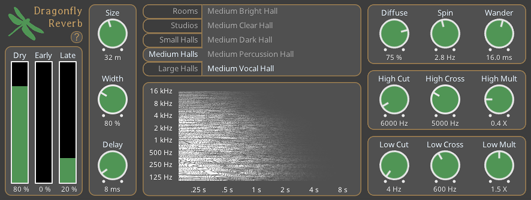

# Dragonfly Reverb
A free hall-style reverb based on freeverb3 algorithms

## Download

* **[Linux](https://github.com/michaelwillis/dragonfly-reverb/releases/download/1.1.2/DragonflyReverb-Linux-64bit-v1.1.2.tgz)**
* **[MacOS](https://github.com/michaelwillis/dragonfly-reverb/releases/download/1.1.2/DragonflyReverb-MacOS-64bit-v1.1.2.zip)**
* **[Windows (32 bit)](https://github.com/michaelwillis/dragonfly-reverb/releases/download/1.1.2/DragonflyReverb-Windows-32bit-v1.1.2.zip)**
* **[Windows (64 bit)](https://github.com/michaelwillis/dragonfly-reverb/releases/download/1.1.2/DragonflyReverb-Windows-64bit-v1.1.2.zip)**

## Dependencies

Dragonfly reverb requires GL >= 3.0 to show the graphical interface.

### Linux Build Dependencies

* libx11-dev
* libgl1-mesa-dev
* libjack-jackd2-dev

## License

Dragonfly Reverb is distributed under the [GPL 3.0 License](https://www.gnu.org/licenses/gpl-3.0.en.html)
